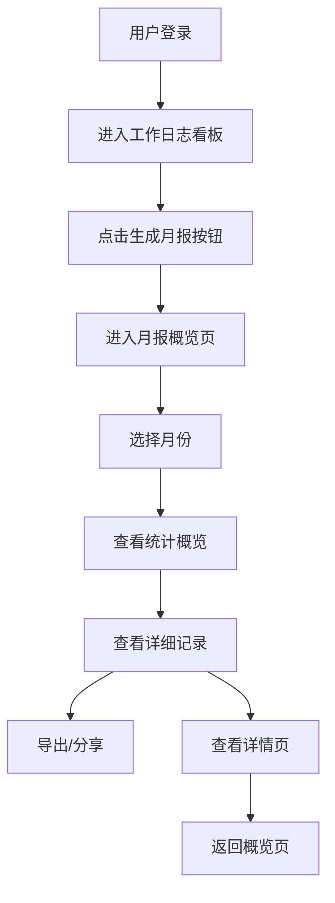

# 月报模型产品需求文档

## 1. 产品概览
月报功能是基于工作日志系统的数据分析与汇总工具，旨在帮助用户自动生成结构化的月度工作报告，实现工作内容的可视化展示和数据化分析。
- 该功能解决了传统手动撰写月报的繁琐问题，通过自动汇总工作日志数据，生成结构化、可视化的月度报告。
- 目标是提升团队工作透明度，为绩效考核和工作规划提供数据支持，同时减轻用户的报告撰写负担。

## 2. 核心功能

### 2.1 功能模块
我们的月报功能包含以下核心页面：
1. **月报概览页**：月度工作数据统计和可视化展示
2. **月报详情页**：详细的工作内容和总结分析

### 2.2 页面详情

| 页面名称 | 模块名称 | 功能描述 |
|---------|---------|--------|
| 月报概览页 | 月份选择器 | 支持用户选择不同年份和月份的月报，提供前后月份快速切换功能 |
| 月报概览页 | 统计概览卡片 | 展示总日志数、交付物数量、最活跃日期、工作类别等关键指标 |
| 月报概览页 | 工作类别分布 | 以列表形式展示Top 5工作类别及其频率，使用不同颜色区分 |
| 月报概览页 | 每日活动统计 | 以条形图形式展示每日工作记录数量，直观反映工作活跃度 |
| 月报概览页 | 详细工作记录 | 展示当月的工作日志详情，包括日期、标签、内容和交付物 |
| 月报概览页 | 导出与分享 | 支持导出PDF格式的月报和生成分享链接功能 |
| 月报详情页 | 报告头部 | 显示报告标题、月份和生成时间 |
| 月报详情页 | 工作概览 | 以卡片形式展示核心工作数据和主要工作类别 |
| 月报详情页 | 详细工作内容 | 按日期顺序展示具体工作内容和相关交付物 |
| 月报详情页 | 总结与反思 | 包含本月工作亮点和改进方向的结构化总结 |

## 3. Core Process
用户使用月报功能的主要流程如下：

**查看月报流程**：
1. 用户登录系统后，从导航菜单或工作日志看板进入月报页面
2. 在月报概览页选择要查看的月份和年份
3. 系统加载并展示该月份的工作数据统计和可视化图表
4. 用户可以浏览详细的工作记录，查看各类统计数据
5. 用户可以选择导出PDF或分享月报
6. 点击具体工作记录可进入月报详情页查看更详细的内容

**数据流转**：
- 系统从后端API获取用户的工作日志数据
- 对数据进行统计分析，计算各项指标
- 生成可视化图表和结构化报告
- 支持导出为PDF或生成分享链接



## 4. 用户接口设计
### 4.1 设计风格
- **主色**：使用Emerald绿色系（#10b981）作为主色调，体现专业、高效的工作氛围
- **辅色**：使用蓝色（#3b82f6）、紫色（#8b5cf6）、橙色（#f97316）等作为功能区分
- **按钮样式**：圆角矩形按钮，主操作使用填充色，次要操作使用边框样式
- **字体**：无衬线字体，标题使用加粗样式，正文使用常规字重
- **布局**：基于卡片式布局，清晰的视觉层次，合理的留白
- **图标**：使用Lucide React图标库，保持风格统一

### 4.2 页面设计概览

| 页面名称 | 模块名称 | UI元素 |
|---------|---------|--------|
| 月报概览页 | 页面头部 | 左侧显示"个人工作月报"标题和描述，右侧显示分享和导出按钮 |
| 月报概览页 | 月份选择器 | 居中的月份导航组件，包含前后箭头和下拉选择框 |
| 月报概览页 | 统计卡片 | 4个并排的统计卡片，每个卡片包含标题、图标、数值和描述 |
| 月报概览页 | 工作类别分布 | 列表形式，每项包含颜色标识、类别名称和数量 |
| 月报概览页 | 每日活动统计 | 水平条形图，显示每日工作记录数量 |
| 月报概览页 | 工作记录列表 | 卡片式布局，每条记录包含时间、标签、内容和交付物 |
| 月报详情页 | 页面头部 | 顶部导航栏，包含返回按钮和操作按钮 |
| 月报详情页 | 报告标题 | 居中的报告标题、月份和生成时间 |
| 月报详情页 | 工作概览 | 3个并排的统计卡片，下方显示主要工作类别标签 |
| 月报详情页 | 工作内容 | 按日期排序的工作记录卡片，包含标题、日期、内容和交付物 |
| 月报详情页 | 总结反思 | 结构化的总结部分，包含工作亮点和改进方向 |

### 4.3 自适应
- 设计采用响应式布局，适配不同屏幕尺寸
- 在移动设备上，统计卡片和图表会自动调整为单列布局
- 支持触摸操作，确保在移动设备上的良好体验
- 字体大小和间距会根据屏幕尺寸自动调整，保证可读性

## 5. 数据结构
### 5.1 日志数据结构
```typescript
interface Log {
  id: string;           // 日志唯一标识
  userId: string;       // 用户ID
  dateTime: string;     // 记录时间（ISO格式）
  tags: string[];       // 工作标签
  content: string;      // 工作内容
  deliverables: Deliverable[]; // 交付物列表
}

interface Deliverable {
  type: 'CODE' | 'DOC' | 'DESIGN'; // 交付物类型
  name: string;        // 交付物名称
  url?: string;        // 交付物链接
}
```

### 5.2 统计数据结构
```typescript
interface MonthlyStats {
  totalLogs: number;   // 总日志数
  totalDeliverables: number; // 总交付物数量
  mostActiveDay: string; // 最活跃日期
  topCategories: {     // 顶部工作类别
    name: string;      // 类别名称
    count: number;     // 出现次数
    color: string;     // 显示颜色
  }[];
  dailyActivity: {     // 每日活动数据
    date: string;      // 日期
    count: number;     // 记录数量
  }[];
}
```

## 6. 技术实现
### 6.1 前端技术栈
- React 18.3.1 + TypeScript
- Vite 6.3.5 作为构建工具
- TailwindCSS 4.1.12 用于样式
- Lucide React 用于图标
- Sonner 用于 toast 通知
- React Router 用于路由管理

### 6.2 后端集成
- 通过Supabase Functions获取日志数据
- 支持JWT认证确保数据安全
- 提供API接口用于日志数据的查询和统计

### 6.3 关键功能实现
- **数据统计**：使用前端计算逻辑处理日志数据，生成统计指标
- **可视化**：使用CSS实现简单的图表和进度条
- **PDF导出**：模拟实现，实际项目中可使用jsPDF等库
- **分享功能**：生成可访问的分享链接

## 7. 未来扩展
- **团队月报**：支持团队级别的月报汇总和分析
- **自定义模板**：允许用户自定义月报模板和内容
- **数据导出**：支持导出为Excel、Word等多种格式
- **工作趋势分析**：提供跨月份的工作趋势分析
- **智能总结**：基于AI自动生成工作总结和反思
- **团队协作**：支持团队成员之间的月报分享和评论

## 8. 结论
月报功能是Traceflow项目的重要组成部分，通过自动汇总和可视化展示工作数据，为用户提供了便捷、高效的工作汇报工具。该功能不仅减轻了用户的报告撰写负担，还为团队管理和个人发展提供了有价值的数据支持。

当前实现已经涵盖了核心功能，包括数据统计、可视化展示、导出分享等。未来可以通过扩展团队功能、智能分析等方向进一步提升产品价值，满足更多用户场景的需求。

**决策点**：
- 月报数据来源：基于现有的工作日志数据，确保数据一致性
- 统计指标：聚焦核心工作指标，避免信息过载
- 可视化方式：采用直观的图表和卡片布局，提升用户体验
- 导出功能：支持PDF格式，满足企业汇报需求

**验证点**：
- 用户对月报数据准确性的反馈
- 导出功能的实际使用频率
- 分享功能的安全性和便捷性
- 不同设备上的响应式体验

**下一步**：
1. 基于现有代码结构，实现月报概览页和详情页的核心功能
2. 测试数据统计和可视化展示的准确性
3. 验证导出和分享功能的可靠性
4. 收集用户反馈，迭代优化功能体验